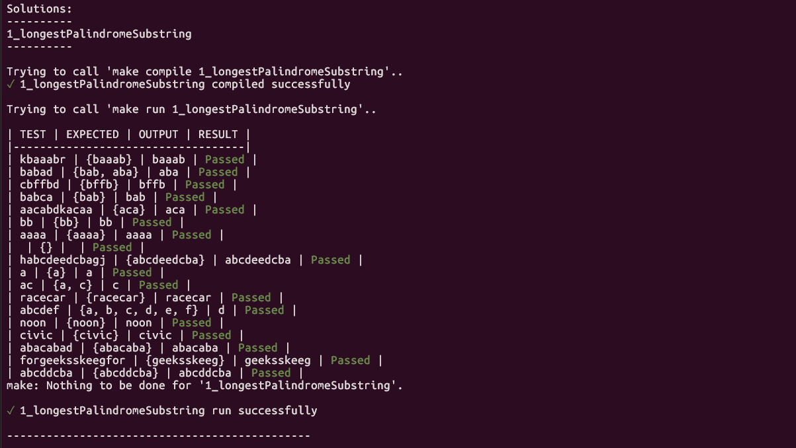

# Problem Solving - C++ Solutions


A comprehensive collection of algorithmic problem solutions implemented in C++, featuring multiple approaches, complexity analysis, and extensive test coverage.

## Table of Contents

- [Overview](#overview)
- [Project Structure](#project-structure)
- [Getting Started](#getting-started)
- [Problems Solved](#problems-solved)
- [Running Tests](#running-tests)
- [Complexity Analysis](#complexity-analysis)
- [Contributing](#contributing)

## Overview

This repository contains well-documented solutions to common algorithmic problems, often asked in technical interviews. Each solution includes:

- **Multiple implementation approaches** with different time/space complexity trade-offs
- **Comprehensive test cases** covering edge cases and various scenarios
- **Detailed explanations** and complexity analysis
- **Clean, readable code** following C++ best practices

## Project Structure

```
ProblemSolving/
├── utils/
│   └── utils.hpp           # Helper utilities for testing and formatting
├── main.cpp                # Entry point
├── run_tests.py            # Python script to automate testing
├── run_tests.sh            # Bash script to automate testing
├── 1_longestPalindromeSubstring/
│   ├── description.md
│   └── solution.cpp
├── 2_twoNumbersSum/
│   ├── ...
|   └── ...
...
└── 8_zigzagConversion/
    ├── explanation.md
    └── solution.cpp
```

## Getting Started

### Prerequisites

- C++ compiler with C++17 support (g++, clang++)
- Make build system
- Python 3.x (for automated testing)

## Quick Start

```bash
# Clone the repository
git clone https://github.com/bsobocki/ProblemSolving.git
cd ProblemSolving
```

### Building

To ***compile*** a specific solution with its tests:

```bash
make compile <solution_directory>
```

Example:
```bash
make compile 2_twoNumbersSum
```

### Running

To ***run*** a specific solution:

```bash
make run <solution_directory>
```

Example:
```bash
make run 2_twoNumbersSum
```

## Running Tests

You can use `run_tests.py` or `run_tests.sh` to ***compile*** and ***run*** solutions with tests.

### Run All Tests

```bash
python run_tests.py
```

### Run Specific Test

```bash
python run_tests.py --test=2
```

or

```bash
python run_tests.py 2_twoNumbersSum
```

### Test Output

The test framework provides colorized output showing:
- Test input
- Expected output
- Actual output
- Pass/Fail status with ✓ or ✗ indicators

Example output:




## Problems Solved

### 1. Longest Palindrome Substring
**Difficulty:** Medium

Find the longest palindromic substring in a given string.

- **Approach:** Expand around center
- **Time Complexity:** O(n²)
- **Space Complexity:** O(1)

---

### 2. Two Sum
**Difficulty:** Easy

Find two numbers in an array that add up to a target value.

**Multiple Solutions:**
- Brute Force: O(n²) time, O(1) space
- Sort + Two Pointers: O(n log n) time, O(n) space
- Hash Map: O(n) time, O(n) space ✅ *Optimal*

---

### 3. Add Two Numbers (Linked Lists)
**Difficulty:** Medium

Add two numbers represented as linked lists, where digits are stored in reverse order.

- **Time Complexity:** O(max(m, n))
- **Space Complexity:** O(max(m, n))

---

### 4. Longest Substring Without Repeating Characters
**Difficulty:** Medium

Find the length of the longest substring without repeating characters.

- **Approach:** Sliding window with hash map
- **Time Complexity:** O(n)
- **Space Complexity:** O(min(m, n)), where m is charset size

---

### 5. Palindrome Number
**Difficulty:** Easy

Determine if an integer is a palindrome without converting to string.

**Multiple Solutions:**
- Vector approach: O(log n) time, O(log n) space
- Reverse full number: O(log n) time, O(1) space
- Reverse half number: O(log n) time, O(1) space ✅ *Most efficient*

---

### 6. Longest Common Prefix
**Difficulty:** Easy

Find the longest common prefix string amongst an array of strings.

- **Time Complexity:** O(S), where S is sum of all characters
- **Space Complexity:** O(1)

---

### 7. Halves Are Alike
**Difficulty:** Easy

Determine if two halves of a string have the same number of vowels.

- **Time Complexity:** O(n)
- **Space Complexity:** O(1)

---

### 8. Zigzag Conversion
**Difficulty:** Medium

Convert a string to zigzag pattern and read line by line.

- **Approach:** Mathematical pattern recognition
- **Time Complexity:** O(n)
- **Space Complexity:** O(n)
- Includes detailed [explanation](8_zigzagConversion/explanation.md)


## Complexity Analysis

Each solution includes detailed complexity analysis:

- **Time Complexity:** How runtime scales with input size
- **Space Complexity:** Additional memory used by the algorithm
- **Trade-offs:** Discussion of different approaches when multiple solutions exist

## Utility Functions

The `utils/utils.hpp` provides:

- **Template-based container printing** - Automatic formatting for STL containers
- **Test result formatting** - Colorized pass/fail indicators
- **Generic testing framework** - Easy-to-use test case evaluation

```cpp
// Example usage
std::vector<int> nums = {1, 2, 3};
std::cout << nums;  // Outputs: {1, 2, 3}

auto result = getTestResultInfo("Test case", expected, actual);
```

## Contributing

Contributions are welcome! To add a new solution:

1. Create a new directory with format: `<number>_<problemName>/`
2. Add `description.md` with problem statement
3. Implement solution in `solution.cpp` with:
   - The solution function
   - Test cases
   - `runSolution()` function
4. Include complexity analysis in comments
5. Ensure all tests pass

## License

This project is open source and available for educational purposes.

## Resources

- [LeetCode](https://leetcode.com/) - Source of many problems
- [Big-O Cheat Sheet](https://www.bigocheatsheet.com/) - Complexity reference
- [C++ Reference](https://en.cppreference.com/) - C++ documentation

## Acknowledgments

Solutions are implemented with a focus on:
- Educational value
- Code readability
- Performance optimization
- Best practices in C++ programming

